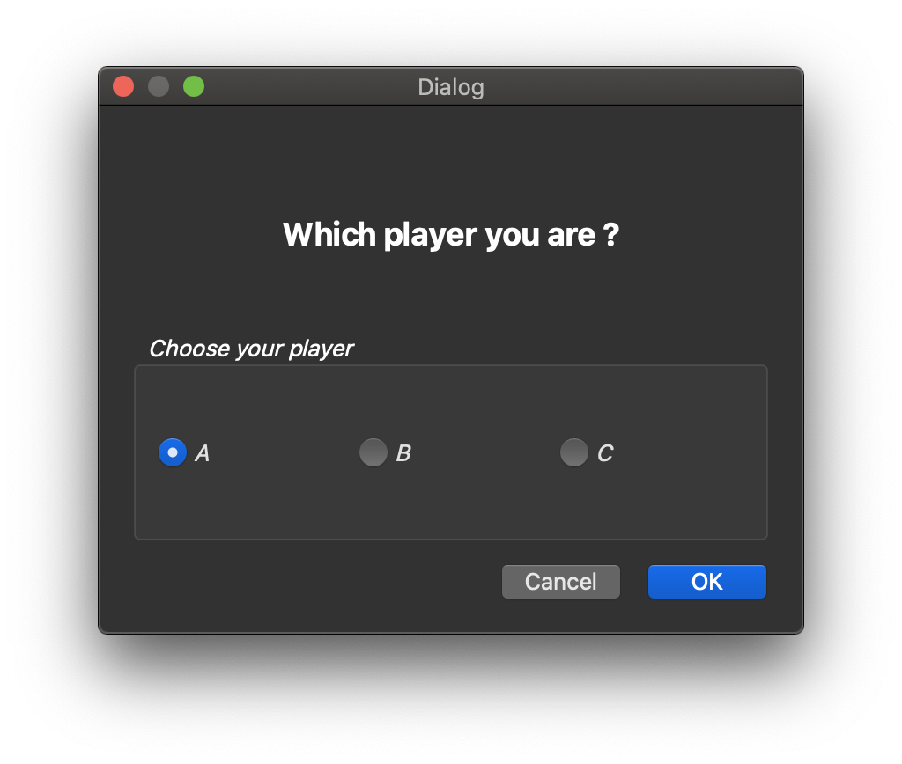
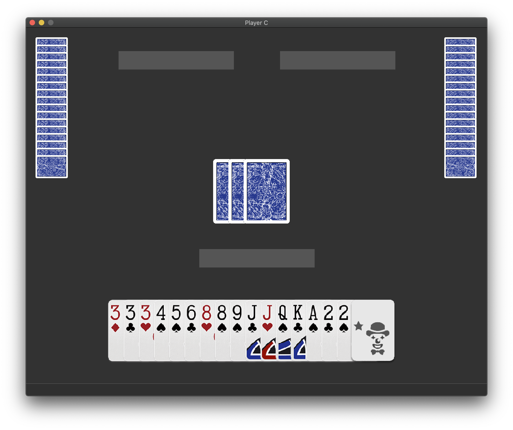
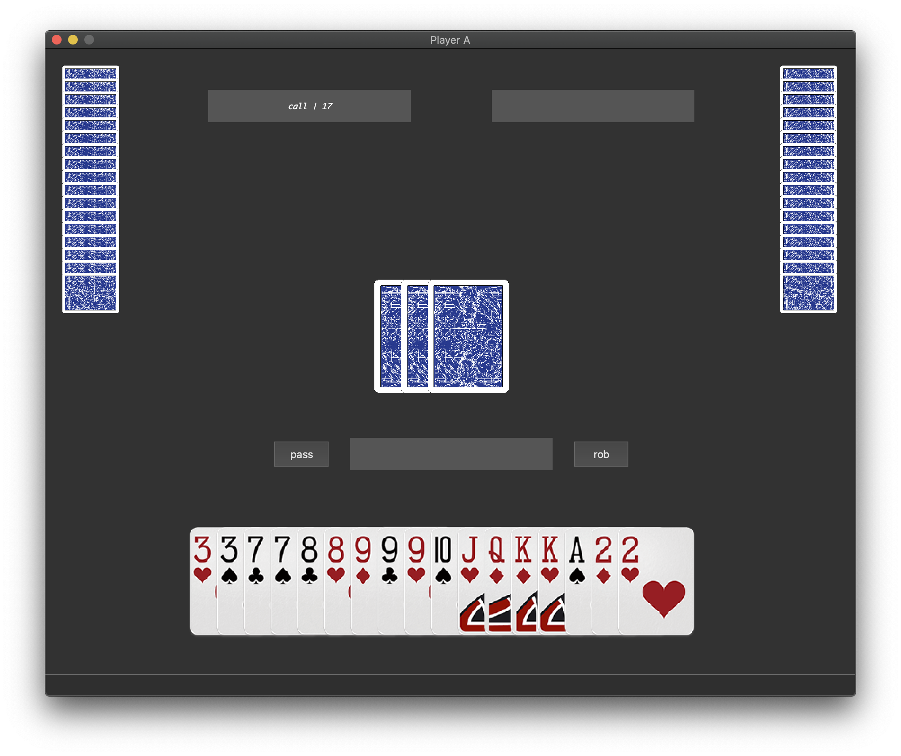
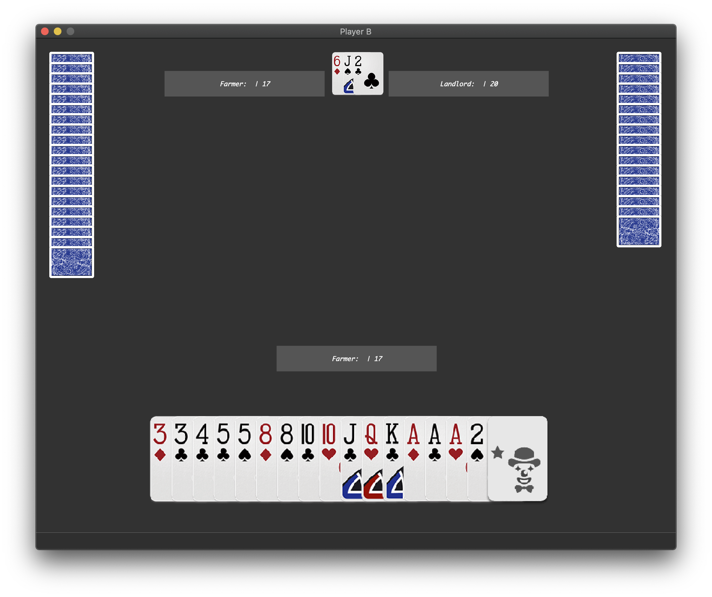
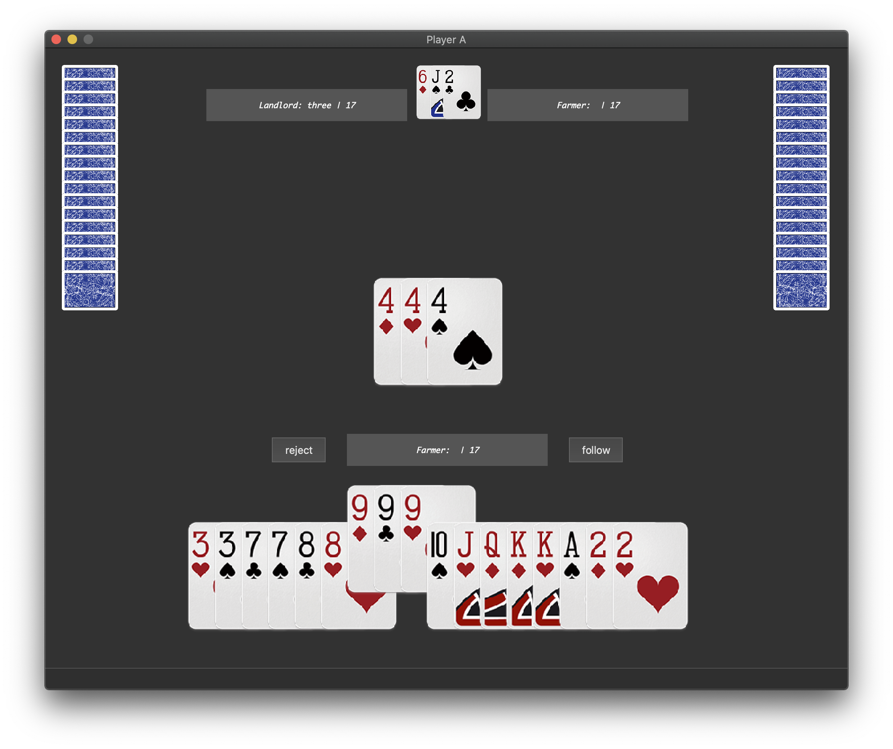
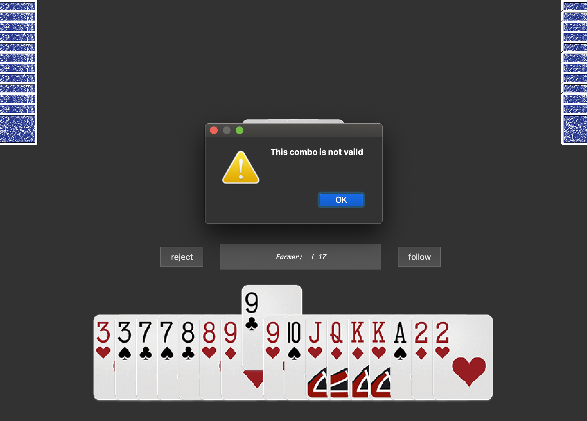
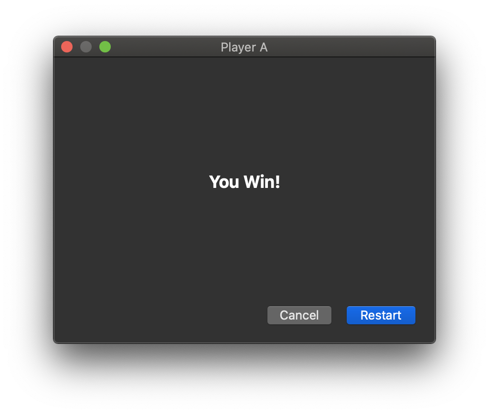

[TOC]

# 测试环境

- OS: macOS 10.15.6
- Processor: 2.3 GHz Dual-Core Intel Core i5
- Memory: 8 GB 2133 MHz LPDDR3
- Graphics: Intel Iris Plus Graphics 640 1536 MB

# 工作流程

## 用户连线

 进入游戏时，会首先进入连接窗口。斗地主需要三个玩家参与，在这里分别是 A、B 和 C。三个玩家需要分别选择对应的 Radio Button 并点击 OK，当三个人的 OK 键都被按下时，连接界面会自动消失，并进入发牌阶段。发牌的过程会经过大概半分钟的动画。当演示结束后，每个用户可以在中间靠下看到自己的排好序的牌型。

同时，界面的上端显示了当前的玩家编号，中间的三个黑色长条将会用来显示剩余牌数等必要的信息。



## 确定地主

当发牌结束后，我们会随机确定一个玩家先开始叫地主。对于第一个玩家，他可以选择叫地主(call)或者不叫(pass)，其余的玩家可以选择抢地主(rob)或者不抢(pass)。当前玩家处理完成后会按照固定的顺序传递给下一个玩家。经过一定的规则限制，我们就可以确定最终的地主是谁。



当地主确认后，中心的三张牌将会分发给地主，并在顶部显示给所有玩家。



## 出牌过程

确定地主之后，将由地主首先开始出牌，出完牌之后按照固定的顺序传递给下一位玩家，直到游戏结束。



对于每位玩家，当想要选中某张牌时，单击即可选择，这时被选中的牌会弹出在上方。如果确定出牌，那么点击 follow 即可出牌。这时相应的牌会从自己的牌堆中移动到中心牌堆，注意到对于其他的玩家这个过程也是可见的。

对于一副牌，如果其本身不是合法的组合，或者不比当前中心牌堆的牌大，那么会弹出相应的窗口提示其不合法。



同时，如果当前的玩家拥有牌权，那么不出(reject)将会是不可选的，此时用户必须出一组合法的牌。

## 游戏结束与重新开始

当任一玩家打完手中的牌时，游戏结束。这时候我们会退出游戏界面，并弹出相应的窗口提示玩家胜利或者失败。



如果用户需要重新开始，那么需要点击 Restart，当三个用户都点击 Restart 之后，将会开始一盘新的游戏。

# 架构设计

## 总体设计

这个游戏大体上分为几个模块，分别是负责网络通讯部分的  `LandlordNetwork`，负责游戏规则判定的 `LandlordCore`，负责界面显示的 `LandlordView`。

基于面向对象的设计理念，在游戏的逻辑实现中每个卡牌是一个 `Poker` 的实例，`PokerGroup` 作为 `Poker` 的容器，实现了一些例如生成全牌堆、洗牌、加牌等面向牌堆的功能。

## 通信协议

通信的部分主要依靠 `LandlordNetwork` 来实现，考虑到我们的数据通讯主要是在交换牌的更替信息，因此我们的一次通信中**必须**包含三个部分，分别是 `PokerGroup`、`NetworkMsg` 以及一个附加的 `value` 来为 `NetworkMsg ` 提供一些必要的区分。

`PokerGroup` 包含了若干个 `Poker`，每个 `Poker` 可以由两个`int`来对应，分别是花色和编号。因此，一个 `PokerGroup` 将会被依次转化为一个表示大小的 `int`以及对应数量的 `Poker` 的花色和编号信息。

`NetworkMsg` 是一个 `enum` 类，因此在传输过程中实际只是若一个整数，具体对应的信息如下：

```cpp
enum class NetworkMsg {
	distributeToMe = 0,
	distributeToDownstream,
	distributeToUpstream,
	setBonus,
	playerCallPass,
	playerCallPassSelected,
	playerChoose,
	updateCentralCards,
	eraseCentral,
};
```

`value` 同样是一个整数，是为了给 `NetworkMsg` 补充一些必要的信息。例如，对于 `updateCentralCards` 这个 `NetworkMsg` 来说，我们需要补充 `value` 来说明中间的牌堆是流向了哪个玩家，这样才能对于每个客户端实现相应的动画效果。

通过重载 `operator<<` 以及 `operator>>`，我们可以使用 `QDataStream` 方便的在这些数据和二进制数据流之间转换。当我们需要将信息转化成数据流时，只需要 `QDataStreamInstance << PokerGroupInstance << NetworkMsgSample << value`，当我们需要将数据流转化成对应的信息时，只需要 `QDataStreamInstance >> PokerGroupInstance >> NetworkMsgSample >> value`。

最后，我们需要在每个数据流前增加四个字节来处理当前数据的大小，来避免所谓的 「黏包」问题。

## 规则设计

规则设计中最主要也最困难的部分就是判定一组牌是否可以接着另一组牌打出。这一部分的实现主要有 `LandlordCore` 来负责。为了实现比较好的游戏效果，我们需要针对每个牌组给出**唯一**的类型。在真实的斗地主中，这样显然是不可能的，因为可能会有一组牌对应很多不同的类型。但是由于我们对游戏规则进行了简化，因此这样处理是没有问题的。

首先，我划分了几个基本牌型，用来简化第一步的处理

```cpp
enum class ComboType {
	undefined = 0,
	single,
	pair,
	bomb,
	rocket,
	threeWith,
	singleContinous,
	doubleContinous,
	fourWith,
	aircraft,
	aircraftWithSingle,
	aircraftWithPair
};
```

实现一些基本的逻辑就可以对这几个大类的牌型进行区分，然后针对每个牌型，我们补充一个整数来划分具体的牌型。例如 `(ComboType::threeWith, 0)` 代表三不带，`(ComboType::threeWith, 1)`表示三带一。

最后，针对牌组的基本类型和子类型，我们就可以对不同的牌组进行区分。然后针对每个牌组获得其对应的权值就可以进行比较了。

# Bug ? Feature !

在实现过程中，针对一些具体的问题，我提出了一些自己的解决方案。

## 对随机连接顺序的支持

我的实现时基于助教在 PPT 中提供的连接模型，其中 A 监听 B 和 C 的链接，B 监听 C 的链接。这样的实现要求我们必须先连接 A，再连接 B，最后连接 C。如果想要乱序连接，一个简单的做法就是在系统中阻塞，不断地向对应端口发出连接请求，这样造成的问题是会产生 UI 的假死，造成糟糕的用户体验。

对于这个问题，我的处理方式是在阻塞的过程中增加对 EventLoop 的处理，这样就可以再不改变原有实现的基础之上实现一个比较良好的乱序连接。

```cpp
tmpSocket -> connectToHost(host, port);
while (!tmpSocket -> waitForConnected()) {
		QElapsedTimer timer;
		timer.start();
		while (timer.elapsed() < 1000) {
			QEventLoop loop;
			loop.processEvents();
    }
}
```

## 顺畅的动画体验

在上一周的作业中，我们中的大部分人都选择重载 `repaint()` 函数对 `QWidget` 暴力重绘，这样的实现显然不够优雅，更不要说实现所谓的动画效果了。而斗地主中卡牌的移动变化，没有动画显然是不可接受的。因此，我学习了  Qt 中的 `Graphics Framework` 以及 `Animation Framework` ，实现了扑克牌的平滑移动。